# Windows 11 Helpdesk Troubleshooting Lab — Logbook

## 2026-07-06 — Part 1: Project setup

### Goal

Create the documentation structure for the Windows 11 Helpdesk Troubleshooting Lab.

### Work completed

* Created the main project folder.
* Created documentation folders.
* Created README.md.
* Created logbook.md.
* Created .gitkeep files so Git can track empty folders.
* Opened the project in VS Code.
* Initialized the local Git repository.
* Created the GitHub repository.
* Pushed the initial project structure to GitHub.
* Captured the initial project structure and Git status screenshots.

### Screenshot evidence

#### Initial project structure

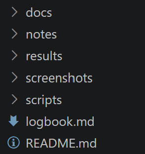

#### Initial Git status

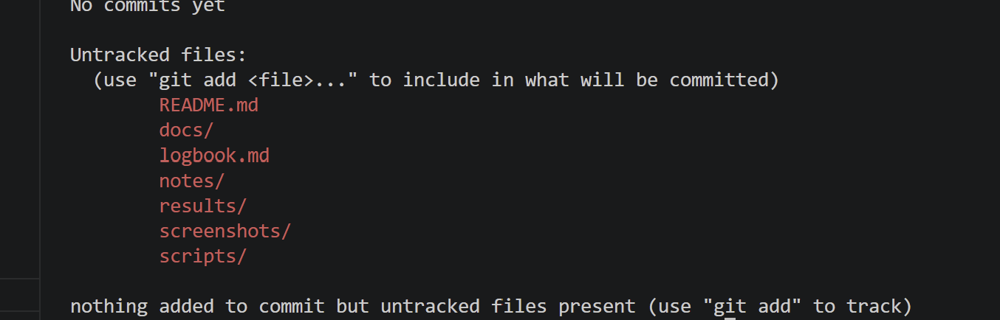

#### Initial push complete

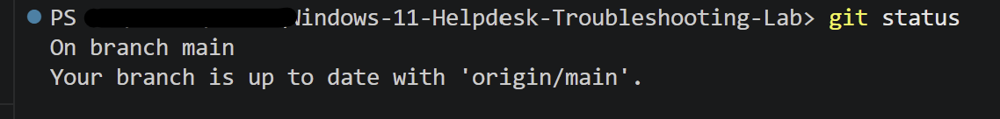

### Notes

This lab documents common Windows 11 helpdesk troubleshooting tasks in a safe local environment.

The project is designed for practical IT support, desktop support and junior sysadmin portfolio use.

---

## 2026-07-06 — Part 2: Windows 11 baseline verification

### Goal

Document the normal baseline state of the Windows 11 lab VM before creating or troubleshooting issues.

The purpose of this part was to confirm the operating system version, system identity, disk status, network configuration, TPM, Secure Boot, Device Manager state and Windows Update state.

### Work completed

* Verified Windows version using `winver`.
* Confirmed the VM is running Windows 11 Pro.
* Recorded Windows version and OS build information.
* Checked the computer name with `hostname`.
* Checked the current logged-in lab user with `whoami`.
* Checked C: drive disk usage with `Get-PSDrive C`.
* Reviewed network configuration with `ipconfig /all`.
* Verified TPM status with `Get-Tpm`.
* Verified Secure Boot status with `Confirm-SecureBootUEFI`.
* Reviewed Device Manager for obvious missing drivers or warning icons.
* Checked Windows Update status.
* Documented a pending security update restart.
* Restarted the VM to complete the update.
* Confirmed Windows Update showed the system as up to date after restart.
* Created a baseline results note in the results folder.

### Commands used

```powershell
winver
hostname
whoami
Get-ComputerInfo | Select-Object WindowsProductName, WindowsVersion, OsBuildNumber, CsName
Get-PSDrive C
ipconfig /all
Get-Tpm
Confirm-SecureBootUEFI
devmgmt.msc
start ms-settings:windowsupdate
```

### Command purpose

| Command | Purpose |
| --- | --- |
| `winver` | Opens the About Windows window and shows the Windows edition, version and build. |
| `hostname` | Shows the computer name. |
| `whoami` | Shows the currently logged-in user account. |
| `Get-ComputerInfo` | Retrieves Windows system information. |
| `Select-Object` | Filters command output to show only selected fields. |
| `Get-PSDrive C` | Shows used and free space on the C: drive. |
| `ipconfig /all` | Shows detailed network adapter, IP, gateway, DNS and DHCP information. |
| `Get-Tpm` | Shows TPM status and whether the TPM is present, ready, enabled and activated. |
| `Confirm-SecureBootUEFI` | Checks whether Secure Boot is enabled. |
| `devmgmt.msc` | Opens Device Manager for hardware and driver review. |
| `start ms-settings:windowsupdate` | Opens the Windows Update page in Settings. |

### Baseline findings

| Area | Result |
| --- | --- |
| Windows edition | Windows 11 Pro |
| Windows version | 25H2 shown in About Windows |
| OS build | 26200.8037 shown in About Windows |
| PowerShell build output | OS build 26200 shown by `Get-ComputerInfo` |
| Computer name | Lab VM hostname verified |
| User account | Local lab user verified |
| Disk status | C: drive checked and available free space confirmed |
| Network status | IP configuration, gateway and DNS reviewed |
| TPM status | TPM present, ready, enabled and activated |
| TPM manufacturer | VMware virtual TPM |
| Secure Boot | Enabled |
| Device Manager | No obvious warning icons or missing-driver issues observed |
| Windows Update before restart | Security update pending restart |
| Windows Update after restart | System showed "You're up to date" |
| Optional update | Preview update available after restart |

### Screenshot evidence

#### Windows version

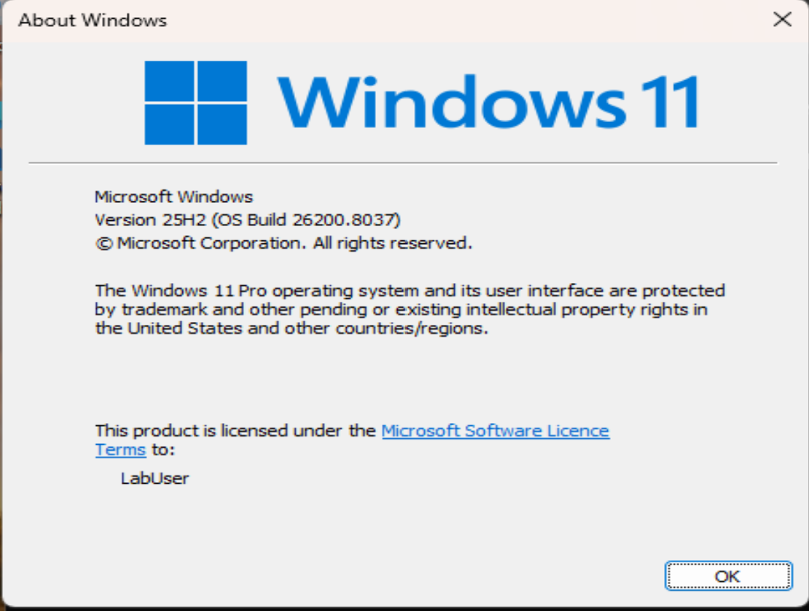

#### System and disk baseline

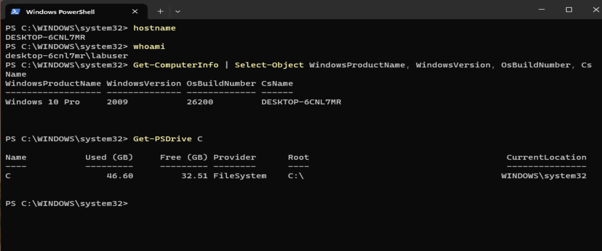

#### Network baseline

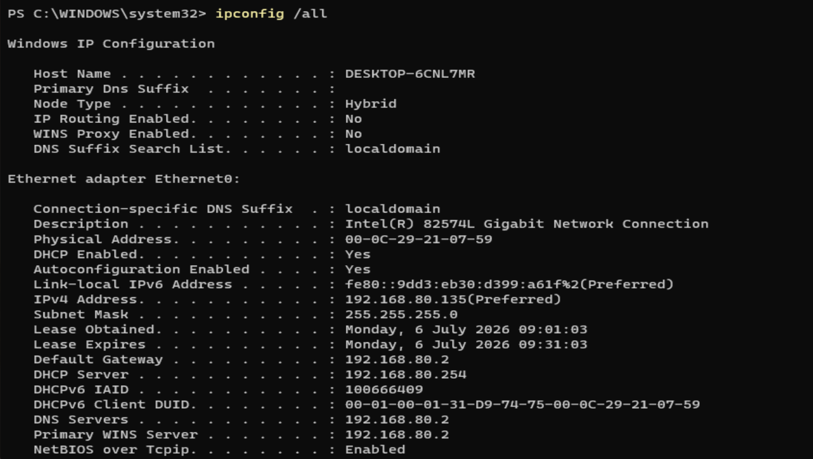

#### TPM and Secure Boot

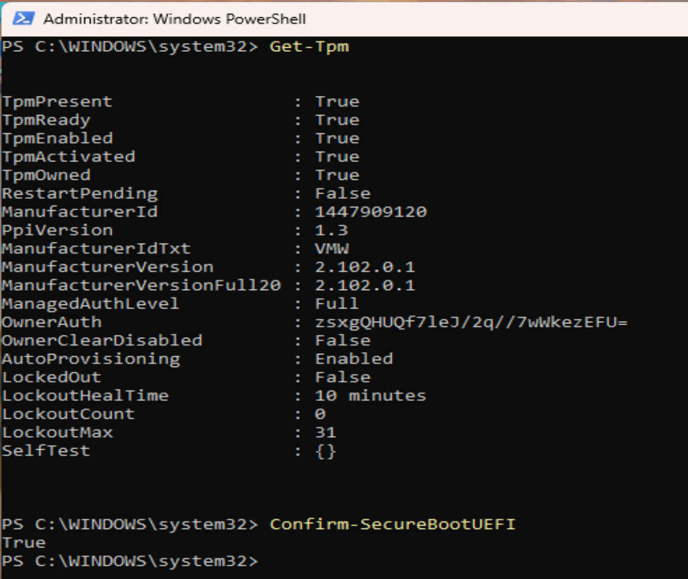

#### Device Manager baseline

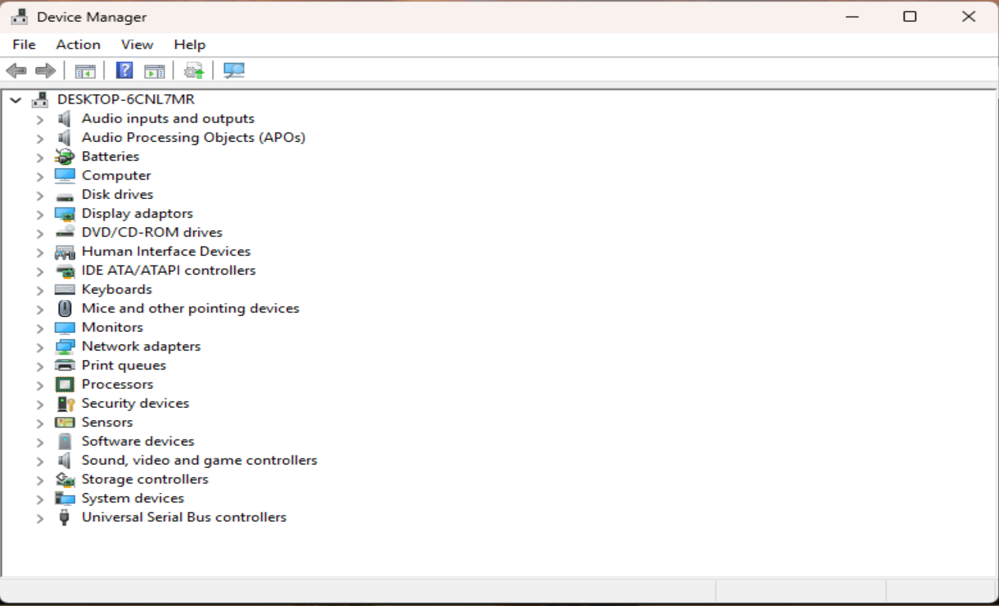

#### Windows Update before restart

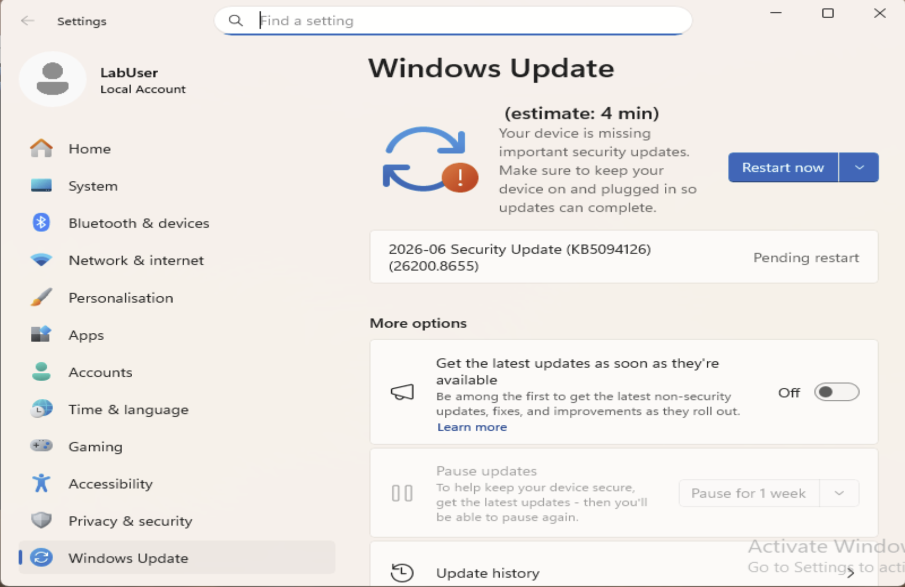

#### Windows Update after restart

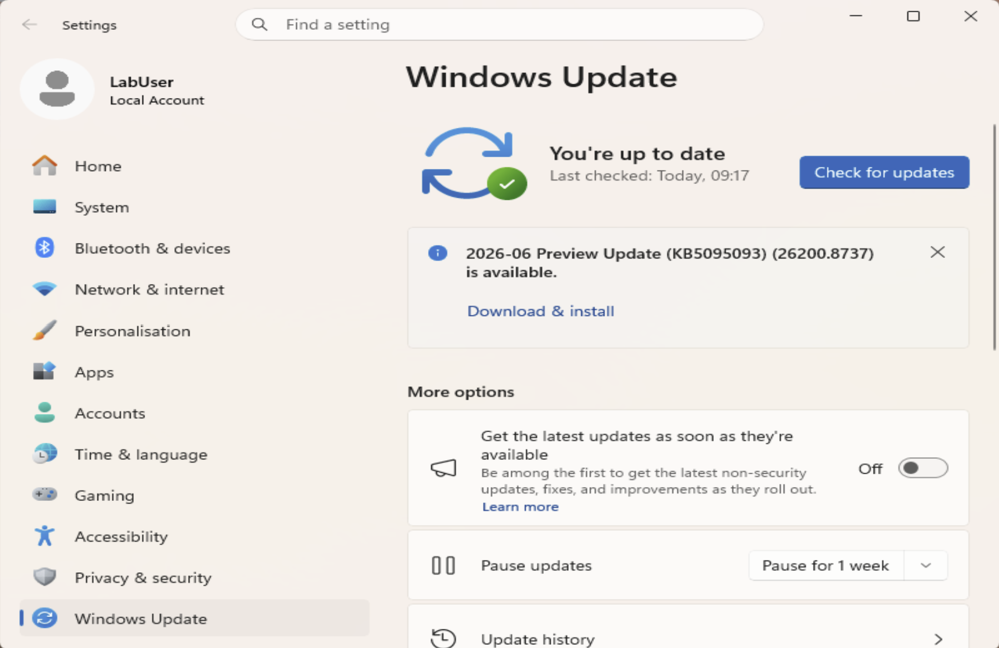

### Results file

| File | Description |
| --- | --- |
| results/windows-11-baseline-results.txt | Contains a written summary of the Windows 11 baseline verification results. |

### Notes

The Windows 11 VM was verified as a working baseline system before troubleshooting scenarios were introduced.

Windows Update initially showed a pending restart for a security update. After restarting, Windows Update showed the system as up to date. An optional preview update was available, but this was not treated as a required baseline issue.

The lab project files, documentation and Git repository are maintained on the host machine, while troubleshooting checks are performed inside the Windows 11 VM.

---

## 2026-07-06 — Part 3: Network troubleshooting lab

### Goal

Practice basic Windows 11 network troubleshooting using PowerShell and standard helpdesk commands.

The purpose of this part was to check IP configuration, DNS resolution, ICMP ping behavior, HTTP connectivity, HTTPS connectivity and DNS cache flushing.

### Work completed

* Reviewed the Windows 11 VM network configuration with `ipconfig /all`.
* Tested DNS name resolution with `nslookup microsoft.com`.
* Tested ICMP connectivity with `ping microsoft.com`.
* Observed that ping to microsoft.com timed out.
* Tested HTTP connectivity with `Test-NetConnection microsoft.com -CommonTCPPort HTTP`.
* Confirmed HTTP TCP connectivity succeeded.
* Tested HTTPS connectivity with `Test-NetConnection microsoft.com -Port 443`.
* Confirmed HTTPS TCP connectivity succeeded.
* Flushed the local DNS resolver cache with `ipconfig /flushdns`.
* Created a network troubleshooting results note in the results folder.

### Commands used

```powershell
ipconfig /all
nslookup microsoft.com
ping microsoft.com
Test-NetConnection microsoft.com -CommonTCPPort HTTP
Test-NetConnection microsoft.com -Port 443
ipconfig /flushdns
```

### Command purpose

| Command | Purpose |
| --- | --- |
| `ipconfig /all` | Shows detailed network adapter, IP address, gateway, DNS and DHCP information. |
| `nslookup microsoft.com` | Tests DNS name resolution by resolving microsoft.com to an IP address. |
| `ping microsoft.com` | Tests ICMP connectivity and packet loss to microsoft.com. |
| `Test-NetConnection microsoft.com -CommonTCPPort HTTP` | Tests TCP connectivity to microsoft.com on port 80 for HTTP traffic. |
| `Test-NetConnection microsoft.com -Port 443` | Tests TCP connectivity to microsoft.com on port 443 for HTTPS traffic. |
| `ipconfig /flushdns` | Clears the local Windows DNS resolver cache. |

### Findings

| Test | Result |
| --- | --- |
| IP configuration | VM network configuration reviewed. |
| DNS lookup | microsoft.com resolved to an IP address. |
| Ping test | Ping timed out with 100% packet loss. |
| HTTP test | TCP connection to port 80 succeeded. |
| HTTPS test | TCP connection to port 443 succeeded. |
| DNS cache flush | DNS resolver cache flushed successfully. |

### Troubleshooting conclusion

The failed ping test did not indicate a full network outage.

Because DNS resolution worked and TCP connectivity succeeded on both HTTP and HTTPS ports, the most likely explanation is that ICMP ping traffic was blocked or ignored by the remote host or network path.

This shows why helpdesk technicians should not rely on ping alone when troubleshooting network issues.

### Screenshot evidence

#### Network configuration

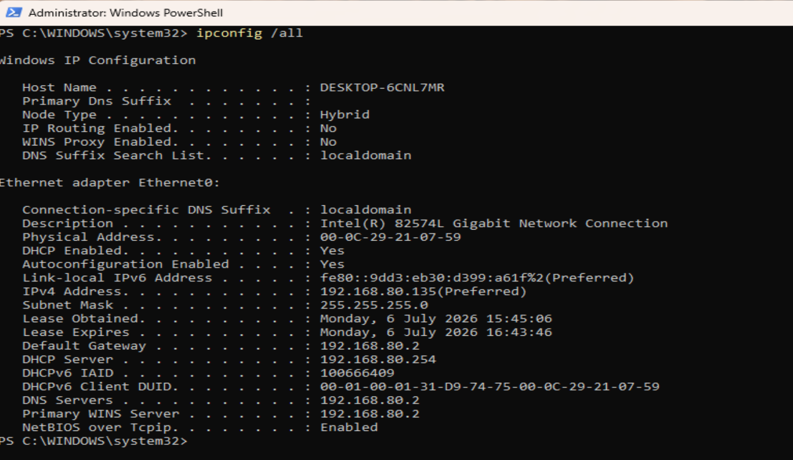

#### DNS lookup

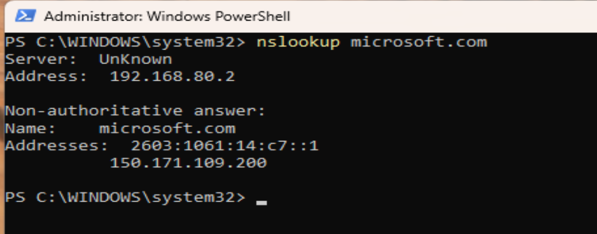

#### Ping test

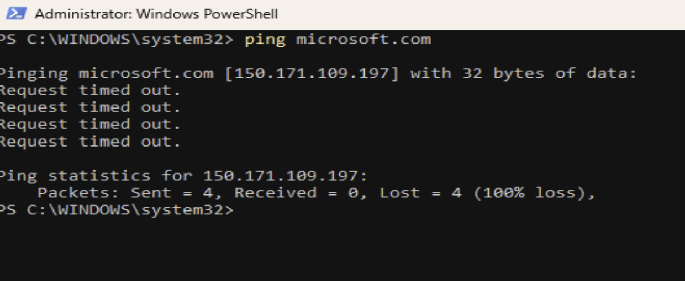

#### HTTP connectivity test

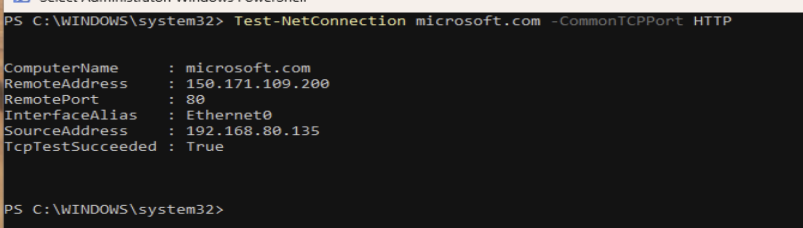

#### HTTPS connectivity test

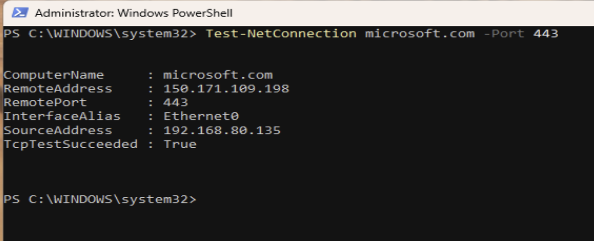

#### DNS cache flush

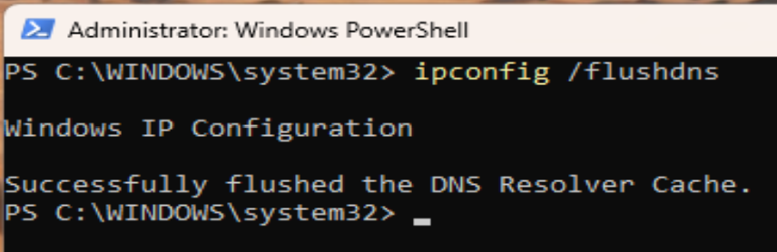

### Results file

| File | Description |
| --- | --- |
| results/windows-11-network-troubleshooting-results.txt | Contains the written network troubleshooting findings and conclusion. |

### Notes

This part demonstrated an important helpdesk troubleshooting principle: a failed ping does not always mean the network connection is broken.

The VM could resolve DNS and connect over HTTP and HTTPS even though ICMP ping timed out.

---

## 2026-07-07 — Part 4: Disk space troubleshooting lab

### Goal

Practice basic Windows 11 disk space troubleshooting using PowerShell and Windows Storage settings.

The purpose of this part was to check C: drive usage, create a safe test file, confirm disk usage behavior, review graphical storage settings and clean up the test data.

### Work completed

* Checked C: drive disk space with `Get-PSDrive C`.
* Created a temporary test folder at `C:\Temp\HelpdeskDiskTest`.
* Created a 100 MB test file using `fsutil file createnew`.
* Confirmed the test file existed with `dir`.
* Checked disk space after creating the test file.
* Opened Windows Storage settings with `start ms-settings:storagesense`.
* Removed the temporary test folder with `Remove-Item`.
* Confirmed the folder was deleted with `Test-Path`.
* Checked final disk space after cleanup.
* Created a disk space troubleshooting results note in the results folder.

### Commands used

```powershell
Get-PSDrive C
mkdir C:\Temp\HelpdeskDiskTest
fsutil file createnew C:\Temp\HelpdeskDiskTest\testfile.bin 104857600
dir C:\Temp\HelpdeskDiskTest
Get-PSDrive C
start ms-settings:storagesense
Remove-Item C:\Temp\HelpdeskDiskTest -Recurse -Force
Test-Path C:\Temp\HelpdeskDiskTest
Get-PSDrive C
```

### Command purpose

| Command | Purpose |
| --- | --- |
| `Get-PSDrive C` | Shows used and free space on the C: drive. |
| `mkdir C:\Temp\HelpdeskDiskTest` | Creates a temporary folder for the disk test. |
| `fsutil file createnew C:\Temp\HelpdeskDiskTest\testfile.bin 104857600` | Creates a 100 MB test file to safely simulate disk usage. |
| `dir C:\Temp\HelpdeskDiskTest` | Lists the test folder contents and confirms the test file exists. |
| `start ms-settings:storagesense` | Opens Windows Storage settings for graphical disk usage review. |
| `Remove-Item C:\Temp\HelpdeskDiskTest -Recurse -Force` | Deletes the test folder and all contents inside it. |
| `Test-Path C:\Temp\HelpdeskDiskTest` | Checks whether the test folder still exists after cleanup. |

### Findings

| Test | Result |
| --- | --- |
| Initial disk check | C: drive usage and free space were reviewed. |
| Test folder creation | Temporary disk test folder was created successfully. |
| Test file creation | 100 MB test file was created successfully. |
| Disk check after file creation | Disk usage was checked again after creating the test file. |
| Storage settings review | Windows Storage settings were opened and reviewed. |
| Cleanup | Test folder and file were removed successfully. |
| Final disk check | Disk space was checked again after cleanup. |

### Troubleshooting conclusion

The Windows 11 VM disk space troubleshooting process was completed successfully.

A safe 100 MB test file was created to simulate disk usage, then removed to confirm cleanup. This demonstrated how a helpdesk technician can verify disk usage before and after cleanup activity.

### Screenshot evidence

#### Disk space before test

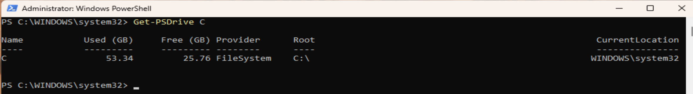

#### Test file created

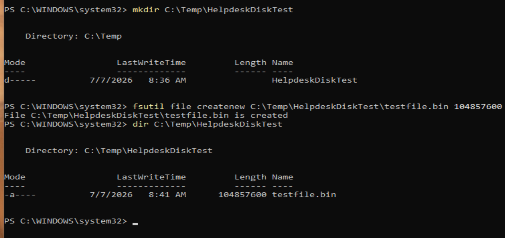

#### Disk space after test file

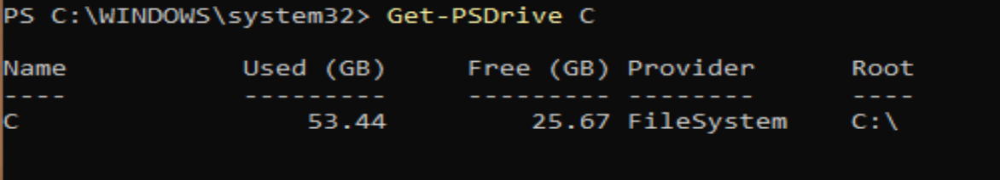

#### Storage settings review

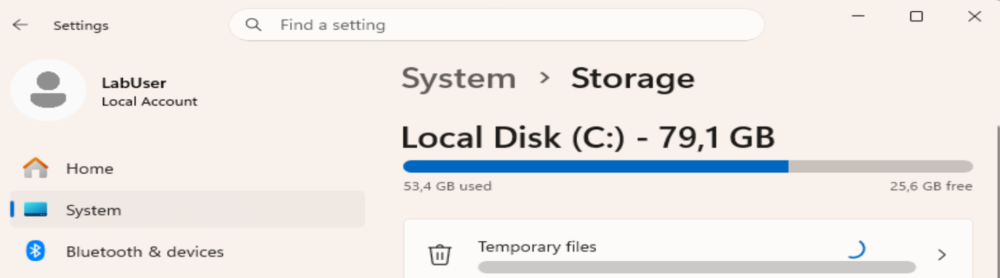

#### Disk space after cleanup

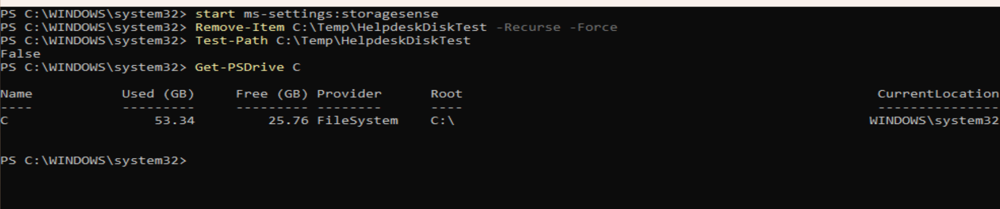

### Results file

| File | Description |
| --- | --- |
| results/windows-11-disk-space-troubleshooting-results.txt | Contains the written disk space troubleshooting findings and conclusion. |

### Notes

This part demonstrated how to check disk space, safely simulate disk usage and clean up test data.

The test file was intentionally small and created only inside the lab VM.

---

## 2026-07-07 — Part 5: Windows Update troubleshooting lab

### Goal

Practice Windows Update troubleshooting using the normal Windows graphical interface first, followed by basic PowerShell service verification.

The purpose of this part was to learn where Windows Update settings are located, how to review update status, how to inspect update history and optional updates, and how to verify related services.

### Work completed

* Opened Windows Update through Settings.
* Reviewed the main Windows Update status page.
* Documented a restart-required state.
* Reviewed Update history.
* Reviewed Advanced options.
* Reviewed Optional updates.
* Located the Windows Update troubleshooter.
* Checked Windows Update-related services with PowerShell.
* Restarted the VM to complete the pending update.
* Checked Windows Update again after restart.
* Created a Windows Update troubleshooting results note in the results folder.
* Skipped the registry-based restart-required check intentionally to focus on GUI navigation and service verification.

### GUI paths used

```text
Start
→ Settings
→ Windows Update
```

```text
Start
→ Settings
→ Windows Update
→ Update history
```

```text
Start
→ Settings
→ Windows Update
→ Advanced options
```

```text
Start
→ Settings
→ Windows Update
→ Advanced options
→ Optional updates
```

```text
Start
→ Settings
→ System
→ Troubleshoot
→ Other troubleshooters
→ Windows Update
```

### PowerShell commands used

```powershell
Get-Service wuauserv
Get-Service bits
Get-Service cryptsvc
Get-Service msiserver
```

### Command purpose

| Command | Purpose |
| --- | --- |
| `Get-Service wuauserv` | Checks the Windows Update service. |
| `Get-Service bits` | Checks the Background Intelligent Transfer Service used for background downloads. |
| `Get-Service cryptsvc` | Checks Cryptographic Services, which help verify signatures and certificates. |
| `Get-Service msiserver` | Checks Windows Installer service status. |

### Findings

| Check | Result |
| --- | --- |
| Windows Update main page | Restart required state was observed. |
| Pending update | Secure Boot Allowed Signature Database (DB) update was pending restart. |
| Update history | Update history was reviewed. |
| Advanced options | Advanced update settings were reviewed. |
| Optional updates | Optional updates page was reviewed. |
| Troubleshooter | Windows Update troubleshooter location was identified. |
| Service check | Windows Update-related services were checked with PowerShell. |
| Restart | VM was restarted to complete the pending update. |
| After restart | Windows Update was reviewed again after restart. |

### Troubleshooting conclusion

The Windows Update troubleshooting process was completed successfully.

This part demonstrated how to start with the normal Windows Settings interface before using PowerShell for service verification. This is useful for helpdesk work because users usually describe problems from the graphical interface, not from command-line output.

### Screenshot evidence

#### Windows Update main status

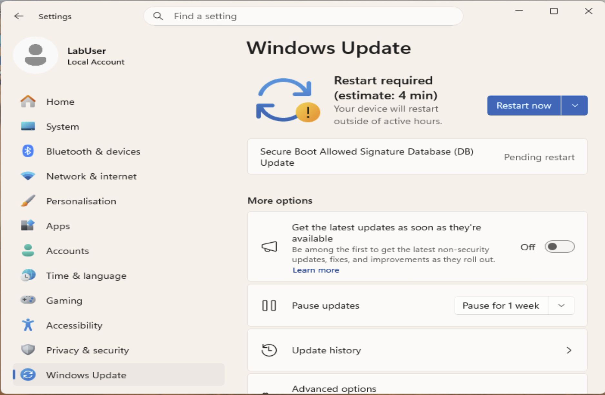

#### Windows Update history

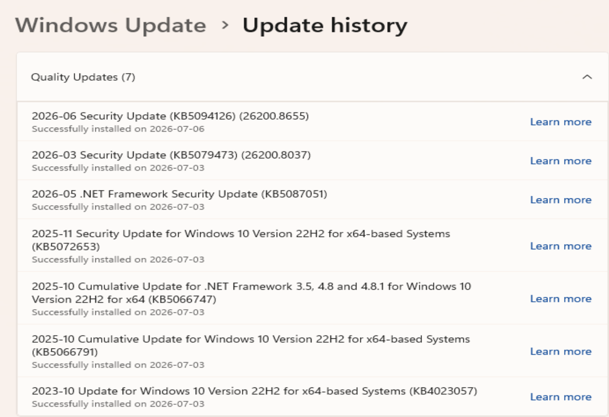

#### Windows Update advanced options

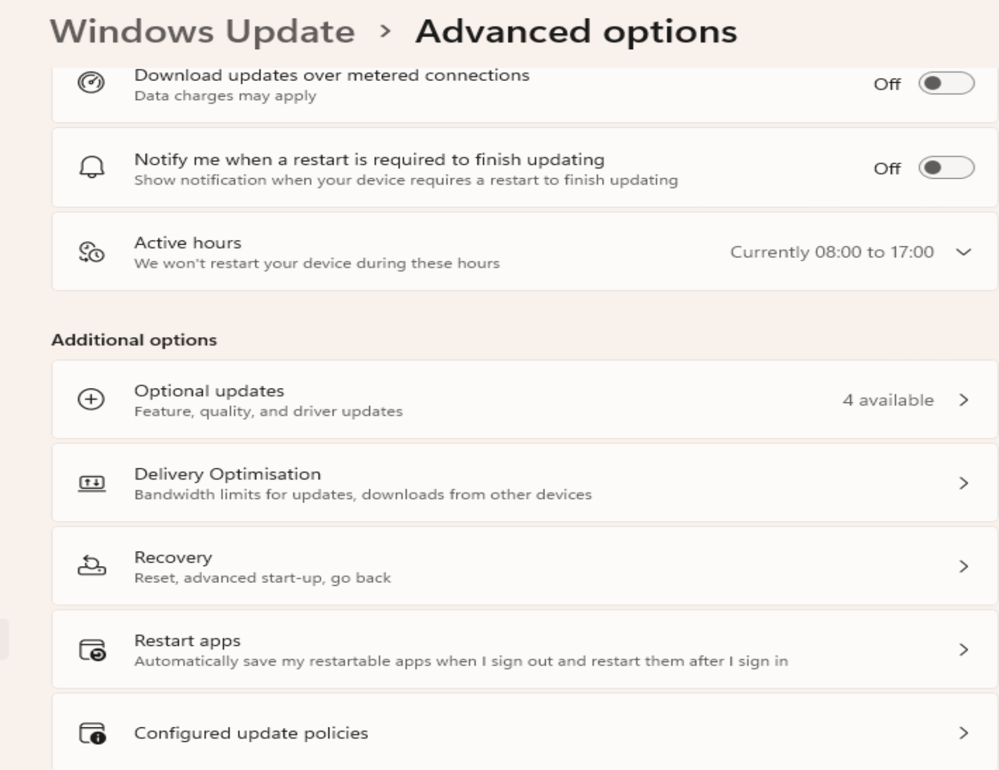

#### Windows Update optional updates

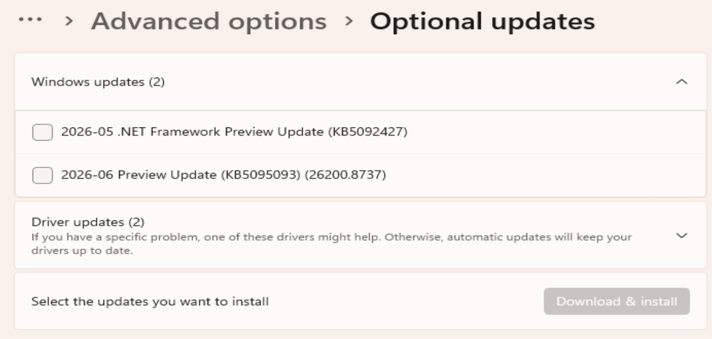

#### Windows Update troubleshooter location

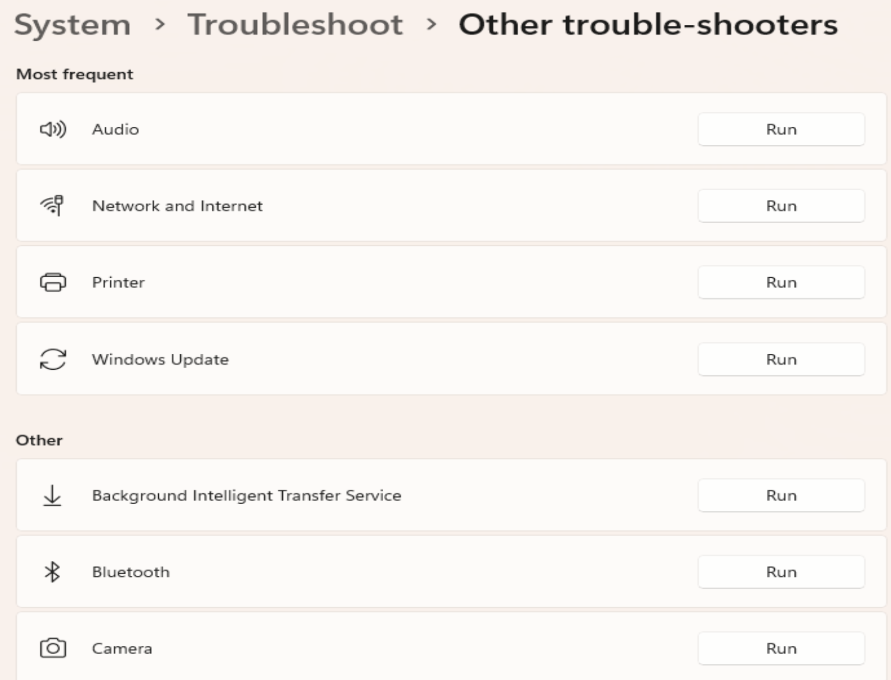

#### Windows Update services

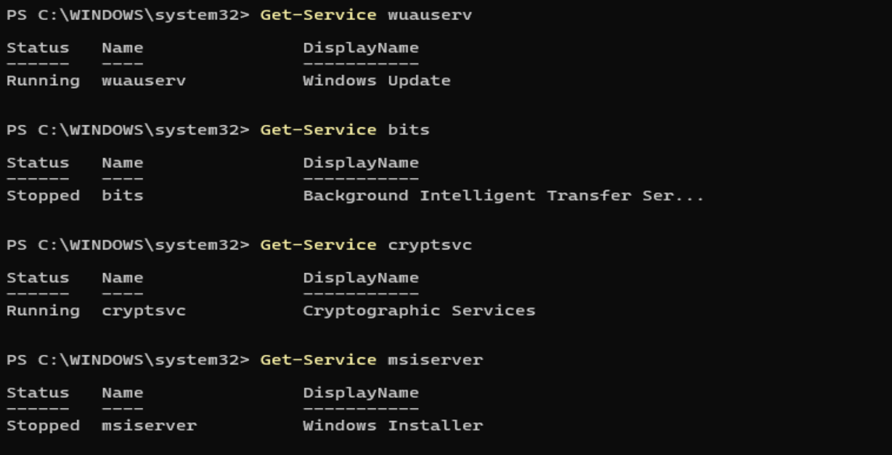

#### Windows Update after restart

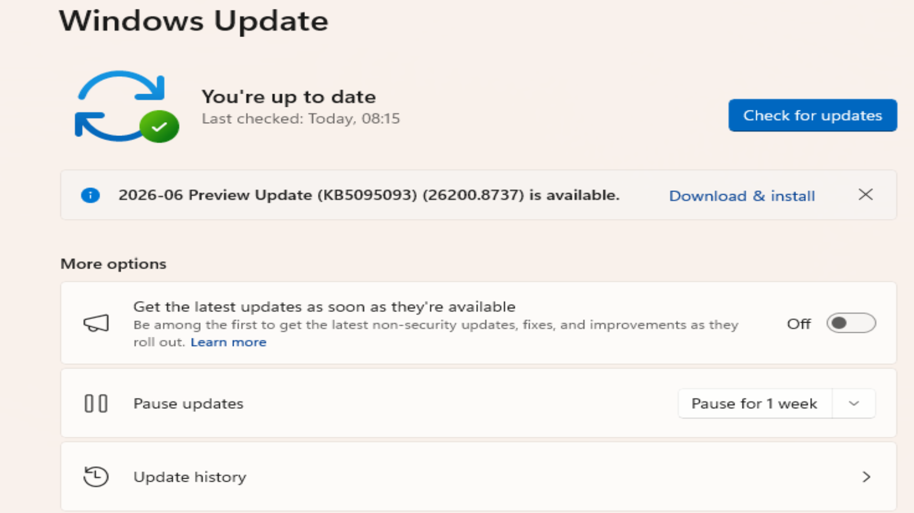

### Results file

| File | Description |
| --- | --- |
| results/windows-11-update-troubleshooting-results.txt | Contains the written Windows Update troubleshooting findings and conclusion. |

### Notes

This part focused more on GUI navigation because helpdesk technicians often need to guide users through Settings before using command-line verification.

The registry-based restart-required check was skipped intentionally.

---

## 2026-07-07 — Part 6: Windows service troubleshooting lab

### Goal

Practice Windows service troubleshooting using the normal Services graphical console first, followed by PowerShell verification.

The purpose of this part was to learn where Windows services are managed, how to inspect a service, how to stop and start it safely, and how to verify the final service state.

### Work completed

* Opened the Services management console.
* Located the Print Spooler service.
* Reviewed the Print Spooler running state.
* Opened the Print Spooler properties window.
* Stopped the Print Spooler service using the GUI.
* Confirmed the service showed a stopped state.
* Started the Print Spooler service again using the GUI.
* Confirmed the service returned to a running state.
* Verified the final Print Spooler service state with PowerShell.
* Created a Windows service troubleshooting results note in the results folder.
* Skipped the optional PowerShell restart step because the GUI stop/start workflow was already completed.

### GUI paths used

```text
Start
→ Search
→ Services
```

```text
Win + R
→ services.msc
```

### Service used

| Service | Purpose |
| --- | --- |
| Print Spooler | Manages print jobs and printer queues in Windows. |

### PowerShell command used

```powershell
Get-Service Spooler
```

### Command purpose

| Command | Purpose |
| --- | --- |
| `Get-Service Spooler` | Checks the current status of the Print Spooler service. |

### Findings

| Check | Result |
| --- | --- |
| Services console | Services management console was opened successfully. |
| Print Spooler location | Print Spooler was found in the services list. |
| Initial state | Print Spooler was running. |
| Properties review | Print Spooler properties window was reviewed. |
| Stop test | Print Spooler was stopped successfully from the GUI. |
| Start test | Print Spooler was started again successfully from the GUI. |
| PowerShell verification | PowerShell confirmed the Print Spooler service state after restoration. |
| Optional PowerShell restart | Skipped intentionally because GUI stop/start was already completed. |

### Troubleshooting conclusion

The Windows service troubleshooting process was completed successfully.

This part demonstrated how to locate a Windows service, inspect its properties, stop it, start it again and verify the final state with PowerShell.

Print Spooler is a useful helpdesk example because printer issues are common in desktop support, especially when print jobs are stuck or printer queues stop responding.

### Screenshot evidence

#### Print Spooler running in Services

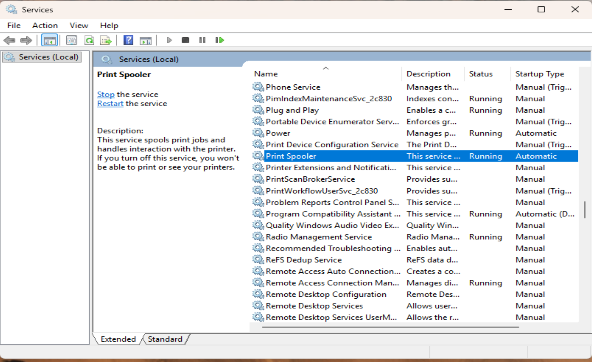

#### Print Spooler properties while running

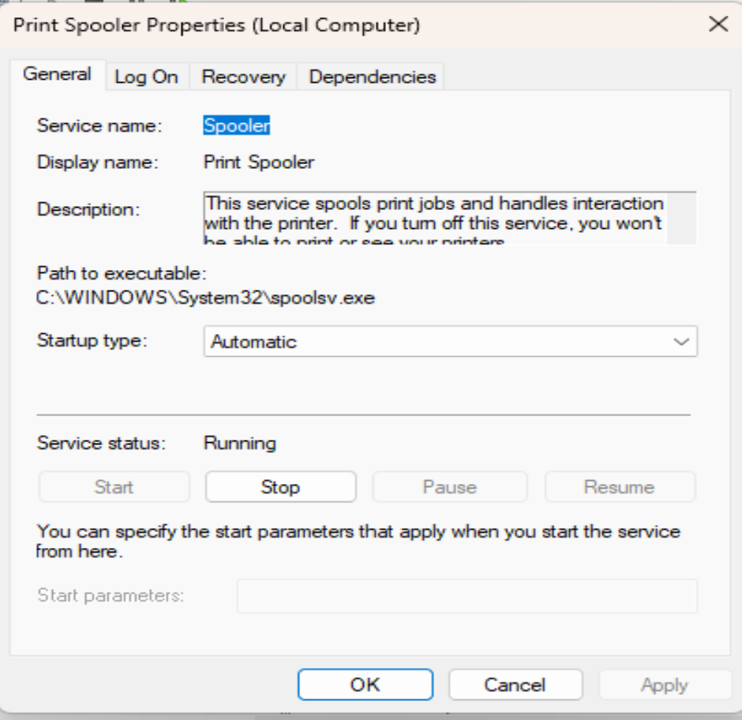

#### Print Spooler stopped in GUI

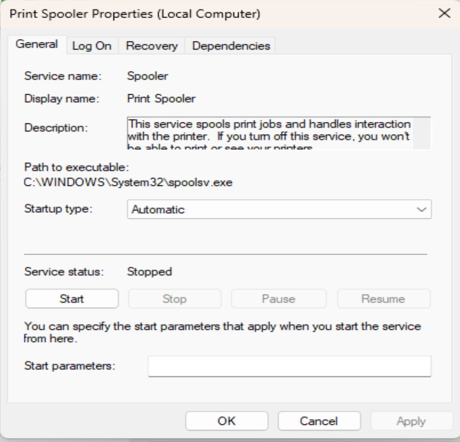

#### Print Spooler restored in GUI

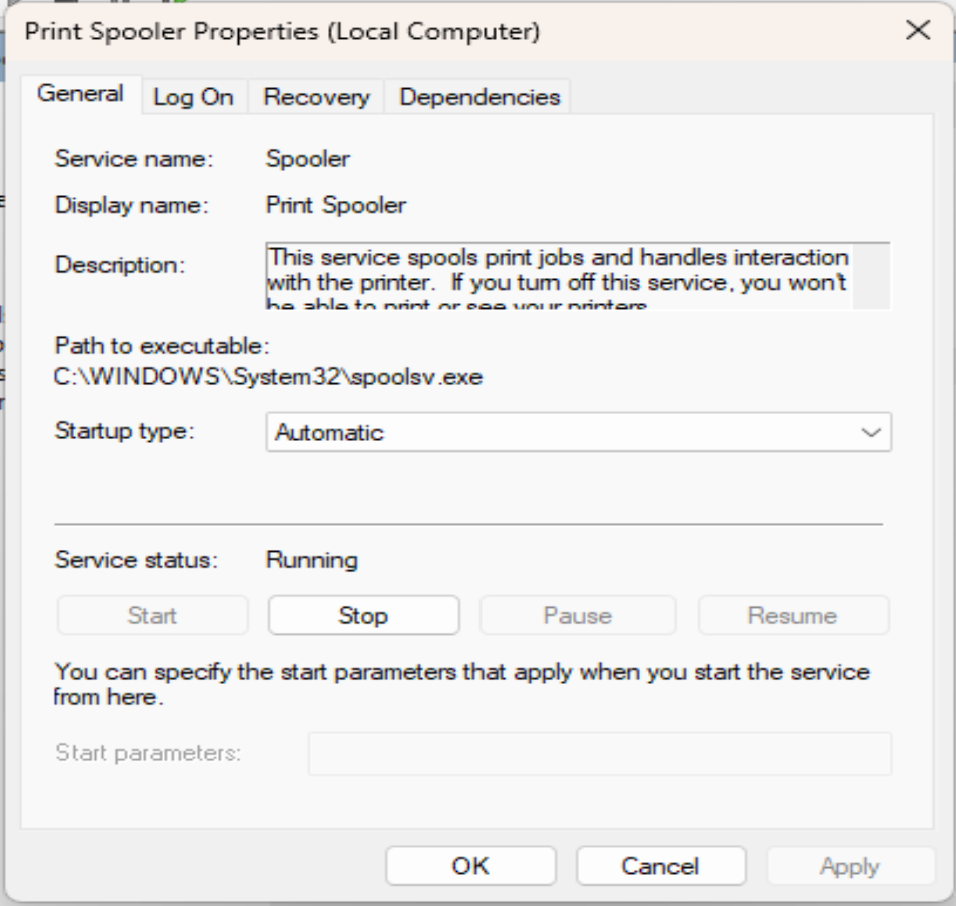

#### Print Spooler PowerShell verification

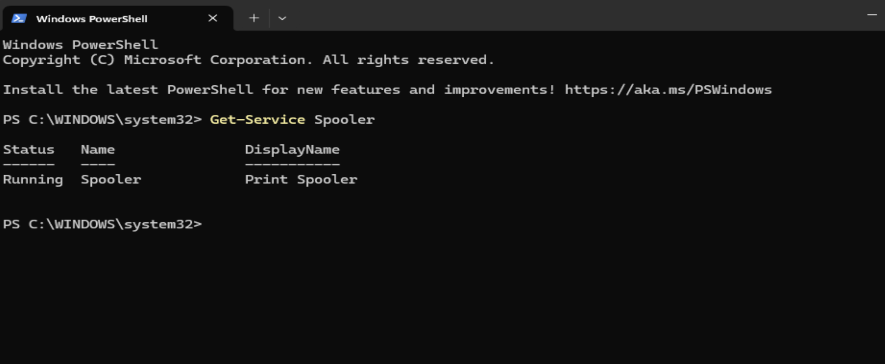

### Results file

| File | Description |
| --- | --- |
| results/windows-11-service-troubleshooting-results.txt | Contains the written Windows service troubleshooting findings and conclusion. |

### Notes

This part focused on GUI-based service troubleshooting because helpdesk technicians often need to guide users or junior technicians through the normal Windows interface.

The optional PowerShell restart step was skipped intentionally because the Print Spooler service was already stopped and started successfully through the Services console.

---

## 2026-07-07 — Part 7: Event Viewer investigation

### Goal

Practice Windows log investigation using Event Viewer first, followed by PowerShell verification.

The purpose of this part was to learn where Windows logs are located, how to review the System log, how to filter warnings and errors, how to inspect event details, and how to verify log access with PowerShell.

### Work completed

* Opened Event Viewer.
* Expanded Windows Logs.
* Opened the System log.
* Reviewed normal System log entries.
* Filtered the System log for Critical, Error and Warning events.
* Opened a Warning event.
* Reviewed the General tab of the event.
* Reviewed the Details tab of the same event.
* Cleared the filter after review.
* Verified System log access with PowerShell.
* Created an Event Viewer investigation results note in the results folder.

### GUI paths used

```text
Start
→ Search
→ Event Viewer
```

```text
Win + R
→ eventvwr.msc
```

### Log reviewed

| Log | Purpose |
| --- | --- |
| Windows Logs → System | Shows system-level Windows events such as service events, driver warnings, restarts, shutdowns, network adapter events and hardware-related warnings. |

### Filter used

| Event level | Purpose |
| --- | --- |
| Critical | Shows serious events that may indicate major system problems. |
| Error | Shows events where something failed. |
| Warning | Shows events that may need attention but are not always active problems. |

### Event reviewed

| Field | Detail |
| --- | --- |
| Log Name | System |
| Source | e1i68x64 |
| Event ID | 27 |
| Level | Warning |
| Message | Network link is disconnected. |

### PowerShell command used

```powershell
Get-WinEvent -LogName System -MaxEvents 5
```

### Command purpose

| Command | Purpose |
| --- | --- |
| `Get-WinEvent` | Reads Windows event logs. |
| `-LogName System` | Selects the System log. |
| `-MaxEvents 5` | Shows only the five newest events. |

### Findings

| Check | Result |
| --- | --- |
| Event Viewer | Opened successfully. |
| System log | Opened successfully. |
| Event filtering | System log was filtered for Critical, Error and Warning events. |
| Warning event | A network link disconnected warning was reviewed. |
| General tab | Human-readable event information was reviewed. |
| Details tab | Structured event data was reviewed. |
| Clear filter | Filter was cleared after investigation. |
| PowerShell verification | System log access was confirmed with `Get-WinEvent`. |

### Troubleshooting conclusion

The Event Viewer investigation process was completed successfully.

This part demonstrated how to use Event Viewer to inspect Windows logs, filter for important event levels, review event details and verify log access using PowerShell.

The selected warning event showed a network link disconnected message. In a lab VM, this type of event may happen when the virtual network adapter reconnects or when the VM network state changes.

### Screenshot evidence

#### Event Viewer open

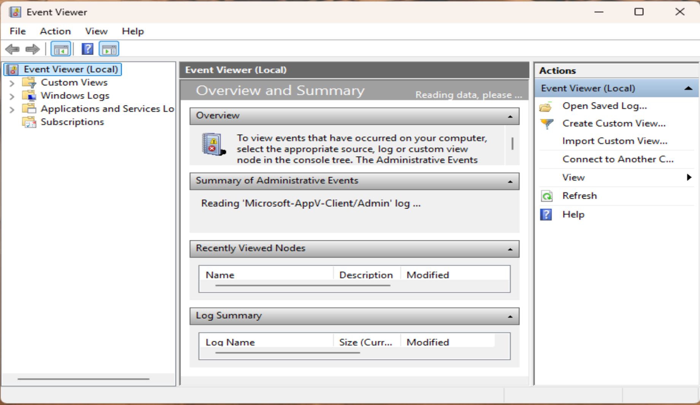

#### System log

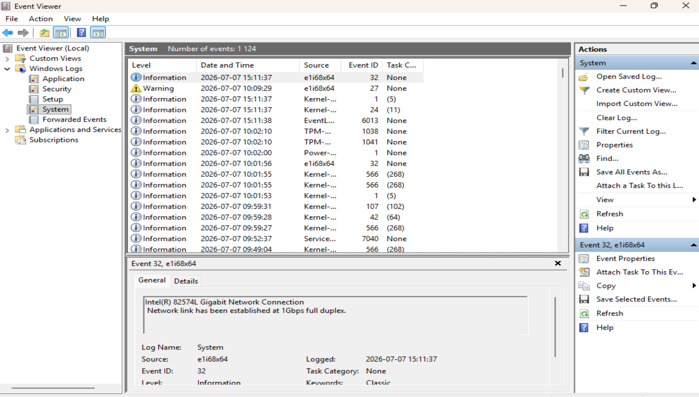

#### Filtered System log

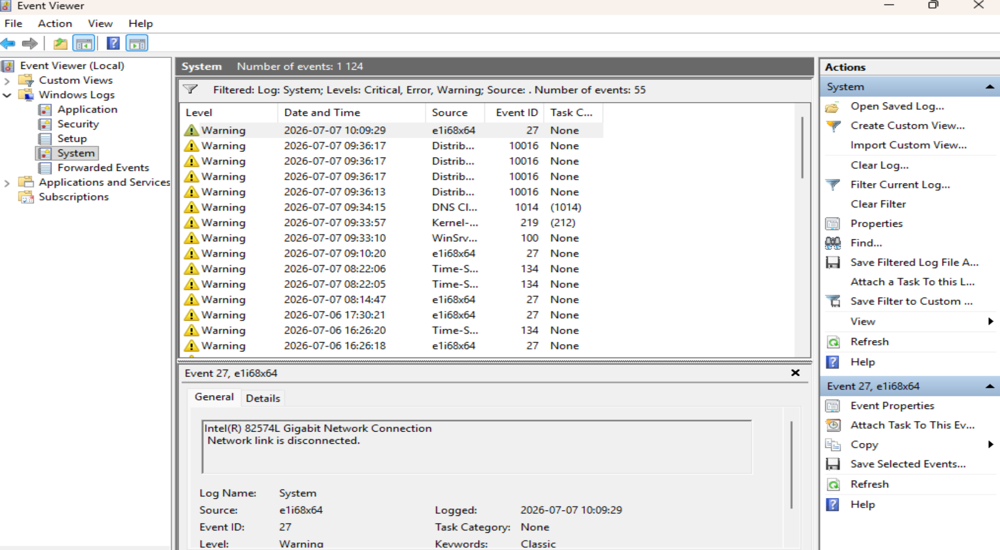

#### Event details General tab

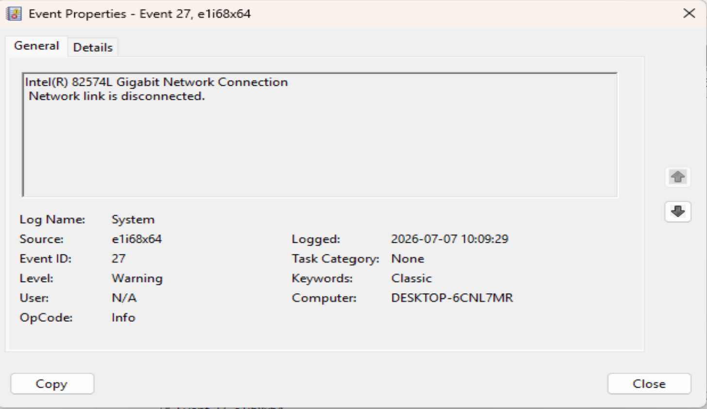

#### Event details Details tab

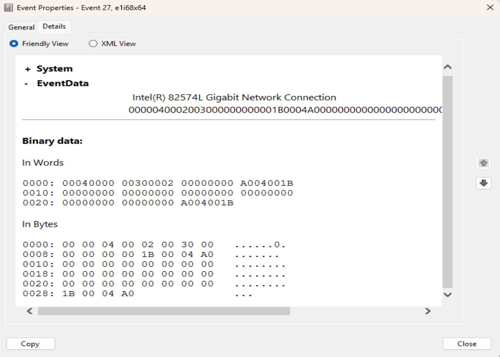

#### Filter cleared

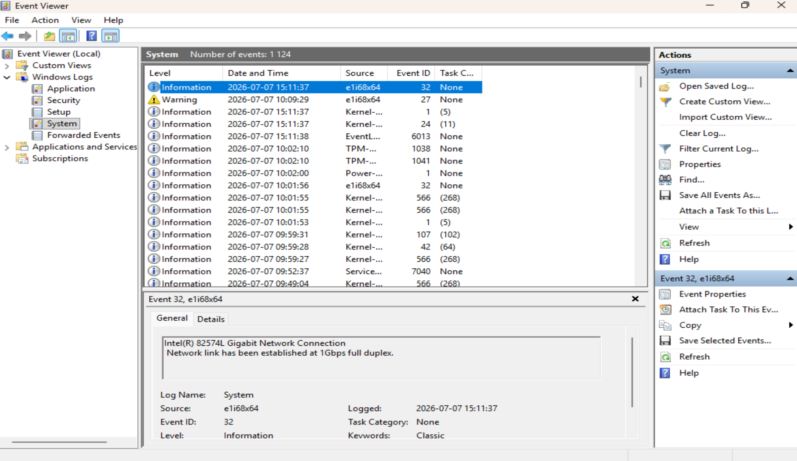

#### PowerShell System log verification

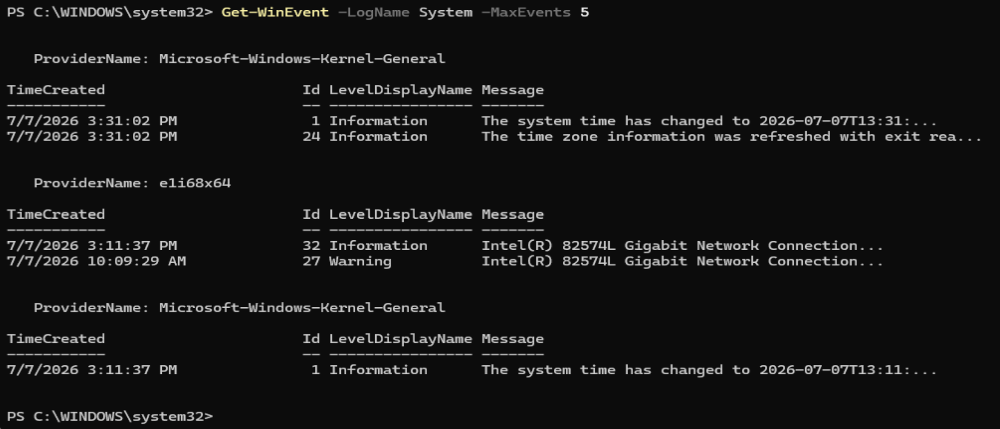

### Results file

| File | Description |
| --- | --- |
| results/windows-11-event-viewer-investigation-results.txt | Contains the written Event Viewer investigation findings and conclusion. |

### Notes

This part focused on Event Viewer as a helpdesk investigation tool.

The reviewed warning event should not be treated as proof of an active issue by itself. Event Viewer findings should be interpreted together with user symptoms, current system behavior and other troubleshooting evidence.

---

## 2026-07-07 — Part 8: Local users and groups

### Goal

Practice reviewing local Windows users and groups using the Computer Management graphical console first, followed by PowerShell verification.

The purpose of this part was to learn where local user accounts and local groups are managed, how to inspect account properties, how to review group membership and how to verify local users and groups from PowerShell.

### Work completed

* Opened Computer Management.
* Opened Local Users and Groups.
* Reviewed the local Users list.
* Opened the LabUser account properties.
* Reviewed the General tab for the LabUser account.
* Reviewed the Member Of tab for the LabUser account.
* Confirmed the LabUser account was a member of the Administrators group.
* Reviewed the local Groups list.
* Opened the Administrators group properties.
* Reviewed members of the Administrators group.
* Verified local users with PowerShell.
* Verified local groups with PowerShell.
* Verified local Administrators group membership with PowerShell.
* Created a local users and groups results note in the results folder.

### GUI paths used

```text
Start
→ Search
→ Computer Management
```

```text
Win + R
→ compmgmt.msc
```

### Area reviewed

| Area | Purpose |
| --- | --- |
| Computer Management | Windows management console used for local administrative tools. |
| Local Users and Groups | Used to review local user accounts and local groups. |
| Users | Shows local user accounts on the computer. |
| Groups | Shows local groups on the computer. |
| Administrators group | Shows accounts with local administrative privileges. |

### PowerShell commands used

```powershell
Get-LocalUser
Get-LocalGroup
Get-LocalGroupMember Administrators
```

### Command purpose

| Command | Purpose |
| --- | --- |
| `Get-LocalUser` | Lists local user accounts on the computer. |
| `Get-LocalGroup` | Lists local groups on the computer. |
| `Get-LocalGroupMember Administrators` | Lists members of the local Administrators group. |

### Findings

| Check | Result |
| --- | --- |
| Computer Management | Opened successfully. |
| Local Users and Groups | Opened successfully. |
| Users list | Local user accounts were visible. |
| LabUser properties | LabUser account properties were reviewed. |
| Member Of tab | LabUser group membership was reviewed. |
| LabUser group membership | LabUser was shown as a member of Administrators. |
| Groups list | Local groups were visible. |
| Administrators group | Administrators group members were reviewed. |
| PowerShell user check | Local users were listed with `Get-LocalUser`. |
| PowerShell group check | Local groups were listed with `Get-LocalGroup`. |
| PowerShell admin group check | Administrators group membership was listed with `Get-LocalGroupMember Administrators`. |

### Troubleshooting conclusion

The Local Users and Groups review was completed successfully.

This part demonstrated how to inspect local user accounts, review local groups, check account group membership and verify the same information using PowerShell.

The LabUser account was shown as a member of the Administrators group. This is acceptable in the lab VM because the account is used for local administrative troubleshooting and documentation.

### Screenshot evidence

#### Local users list

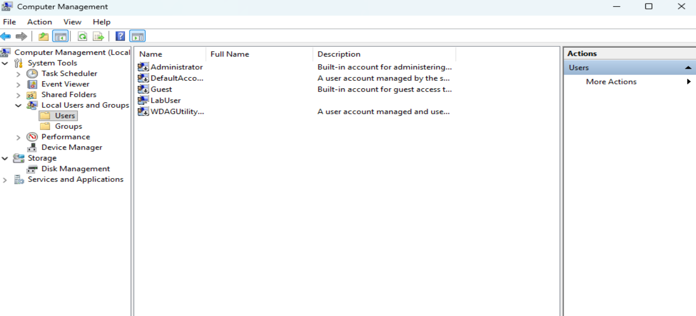

#### Local user properties

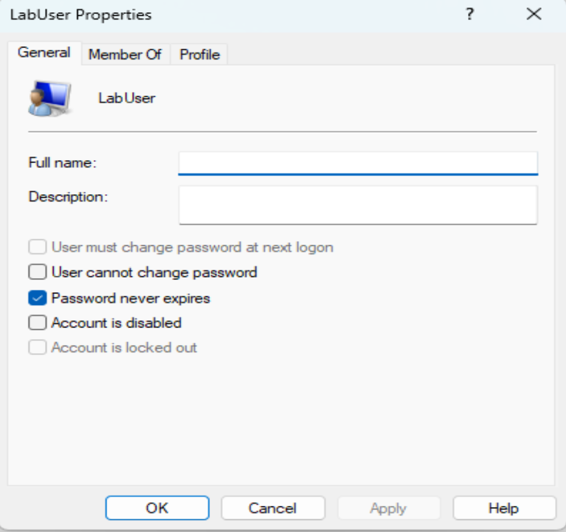

#### Local user Member Of tab

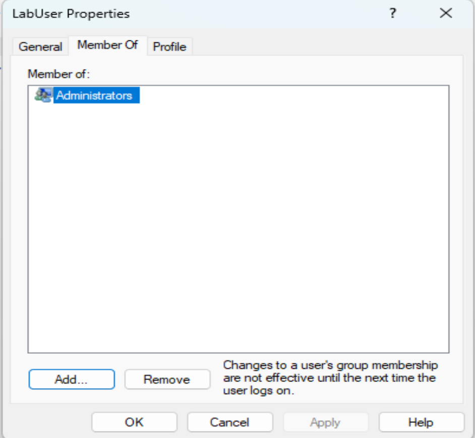

#### Local groups list

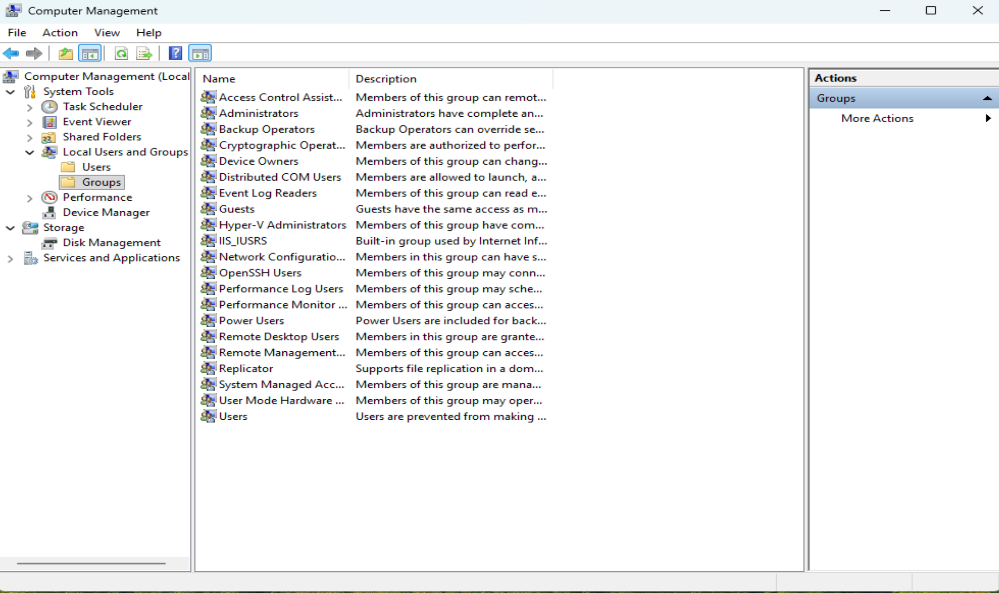

#### Administrators group members

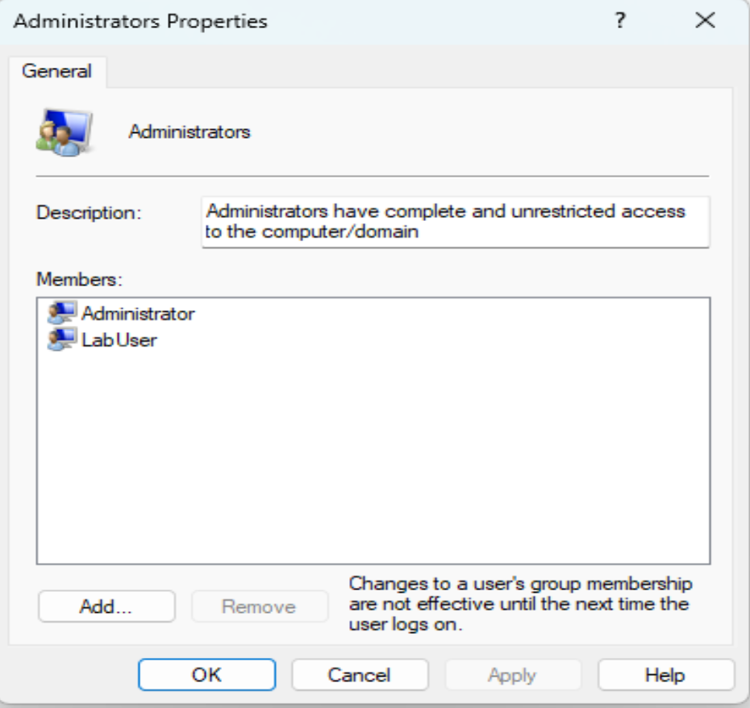

#### PowerShell Get-LocalUser

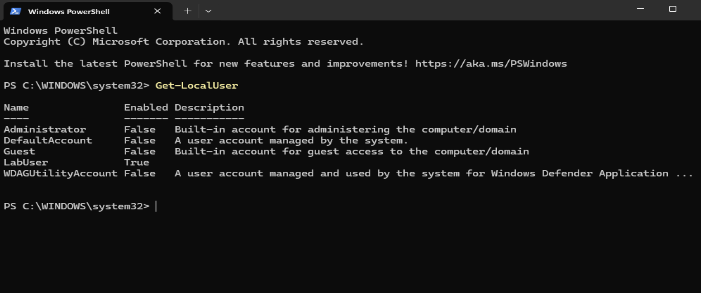

#### PowerShell Get-LocalGroup

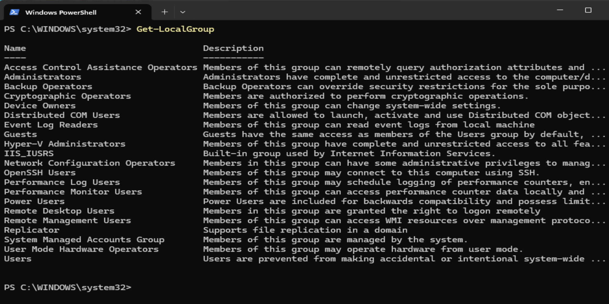

#### PowerShell Administrators group members

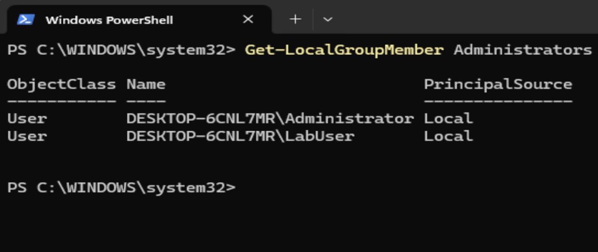

### Results file

| File | Description |
| --- | --- |
| results/windows-11-local-users-groups-results.txt | Contains the written local users and groups findings and conclusion. |

### Notes

This part focused on local Windows account and group review.

Administrative group membership should always be reviewed carefully. In this lab, LabUser being a member of Administrators is acceptable because the VM is used for local testing and administrative troubleshooting.

---

## 2026-07-07 — Part 9: Printer troubleshooting simulation

### Goal

Practice a common Windows printer troubleshooting workflow using GUI tools first, followed by PowerShell verification.

The purpose of this part was to learn where printer settings are located, how to inspect installed printers, how to open a print queue, how to review printer properties and how to verify printer-related information with PowerShell.

### Work completed

* Opened Printers & scanners.
* Reviewed installed printers.
* Opened Microsoft Print to PDF settings.
* Opened the print queue.
* Reviewed printer properties.
* Checked Print Spooler in Services.
* Restarted Print Spooler from the Services GUI.
* Verified Print Spooler status with PowerShell.
* Listed installed printers with PowerShell.
* Created a printer troubleshooting results note in the results folder.

### GUI paths used

```text
Start
→ Settings
→ Bluetooth & devices
→ Printers & scanners
```

```text
Start
→ Search
→ Printers & scanners
```

```text
Start
→ Search
→ Services
```

### Printer reviewed

| Printer | Purpose |
| --- | --- |
| Microsoft Print to PDF | Built-in Windows virtual printer used for safe printer troubleshooting practice without physical hardware. |

### PowerShell commands used

```powershell
Get-Service Spooler
Get-Printer
```

### Command purpose

| Command | Purpose |
| --- | --- |
| `Get-Service Spooler` | Checks the current status of the Print Spooler service. |
| `Get-Printer` | Lists installed printers on the computer. |

### Findings

| Check | Result |
| --- | --- |
| Printers & scanners | Opened successfully. |
| Installed printers | Installed printers were visible. |
| Microsoft Print to PDF | Virtual printer was available and selected. |
| Print queue | Print queue was opened. |
| Printer properties | Microsoft Print to PDF properties were reviewed. |
| Print Spooler | Print Spooler was checked in Services. |
| Spooler restart | Print Spooler was restarted using the GUI. |
| PowerShell service check | Print Spooler status was verified with `Get-Service Spooler`. |
| PowerShell printer check | Installed printers were listed with `Get-Printer`. |

### Troubleshooting conclusion

The printer troubleshooting simulation was completed successfully.

This part demonstrated how to inspect printer settings, open the print queue, review printer properties, restart Print Spooler and verify printer-related information with PowerShell.

Microsoft Print to PDF was used because it is a safe built-in virtual printer that does not require physical printer hardware.

### Screenshot evidence

#### Printers & scanners overview

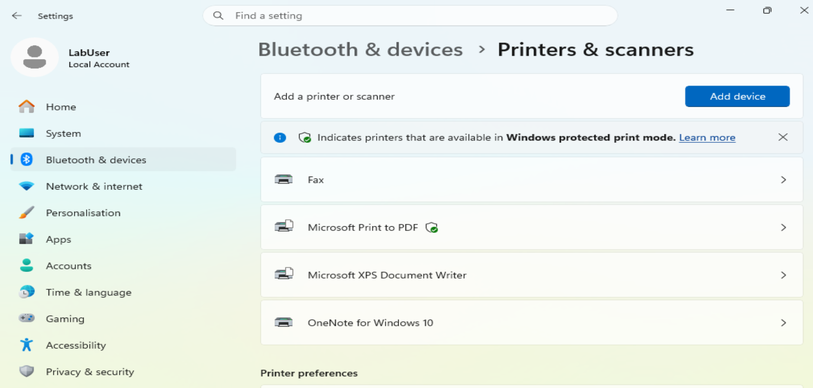

#### Microsoft Print to PDF selected

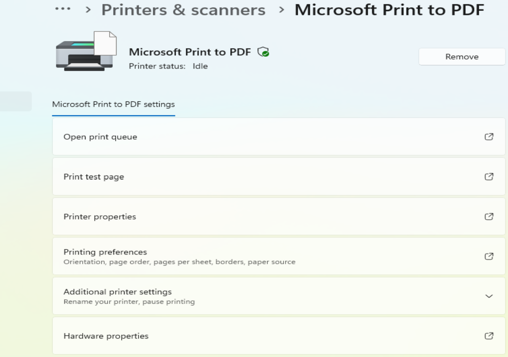

#### Print queue open


#### Printer properties or preferences

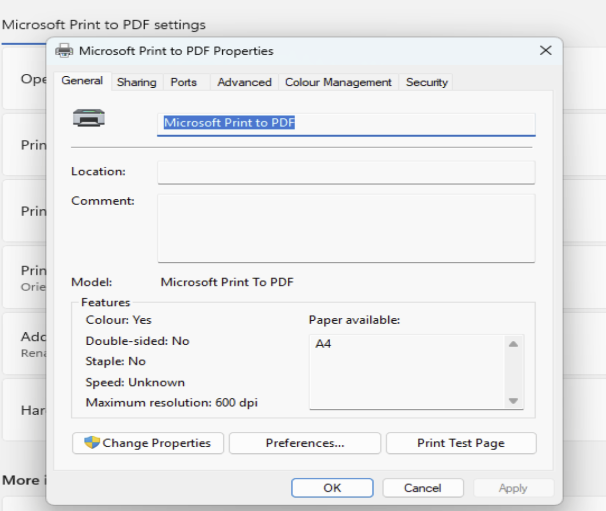

#### Print Spooler running for printer lab

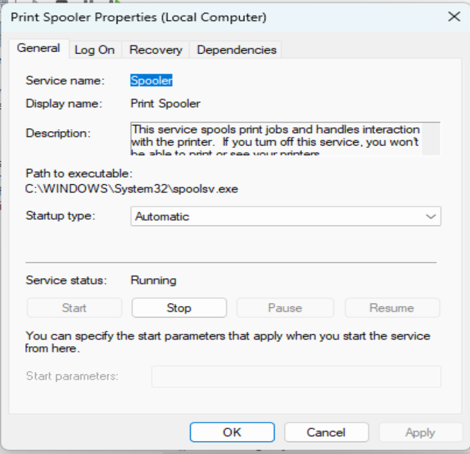

#### Print Spooler restarted in GUI

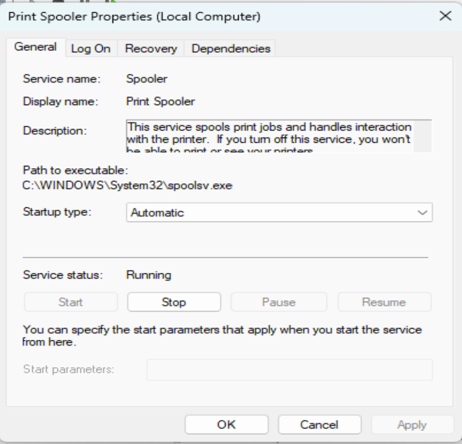

#### PowerShell Spooler check

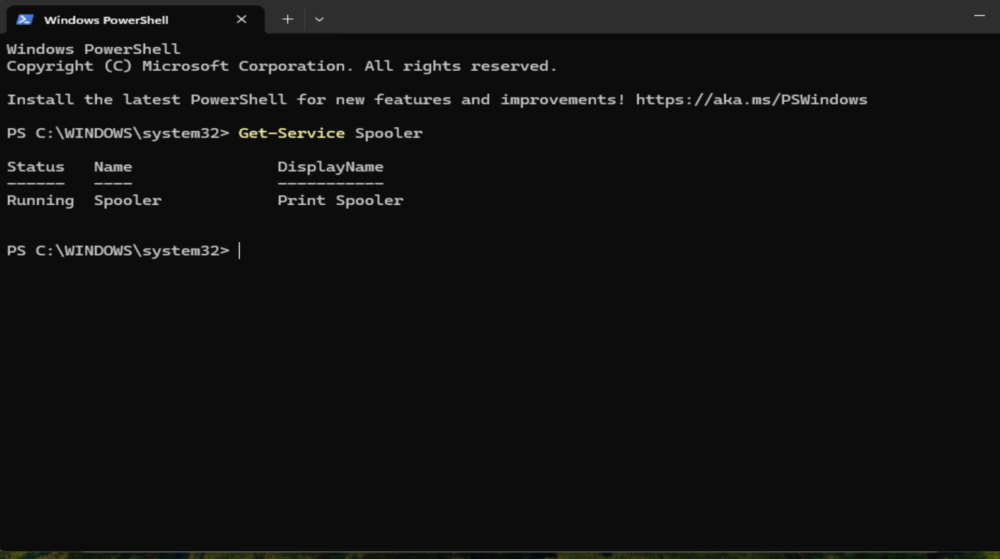

#### PowerShell Get-Printer

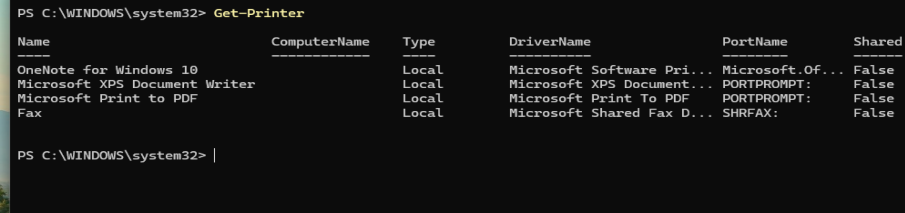

### Results file

| File | Description |
| --- | --- |
| results/windows-11-printer-troubleshooting-results.txt | Contains the written printer troubleshooting simulation findings and conclusion. |

### Notes

This part simulated printer troubleshooting without physical printer hardware.

Microsoft Print to PDF was used as a safe virtual printer. Print Spooler was restarted as a common helpdesk troubleshooting step for printer queue and print job issues.

